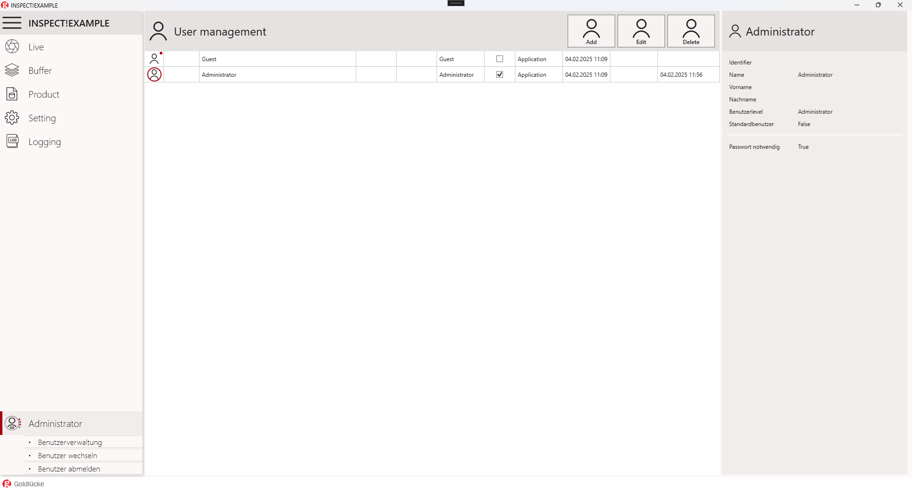

# User Management

### General

User Management liefert detaillierte Informationen über interne Programmabläufe.

### GUI

### Öffnen der Benutzerverwaltung

{: class="no-audio" }

### Benutzer-Ebene

Der Zugriff auf verschiedene Funktionen des Programms wird basierend auf der aktuellen Benutzerebene freigeschalten.
Jede Benutzerebene erbt die Berechtigungen der darunter liegenden Ebenen:

- Guest – Eingeschränkte Funktionalität
- Operator – Für den Betrieb erforderliche Funktionalität
- Technician - Erweiterter Zugriff zum Bearbeiten von Einstellungen
- Administrator – Berechtigungen zum Verwalten von Benutzerrollen und Berechtigungen

### Erstellen eines neuen Benutzers

{: class="no-audio" }

### Standardbenutzer

Der "Standardbenutzer" ist der Benutzer der automatisch bei Programmstart eingeloggt wird.
Der Standardbenutzer kann von einem Benutzer auf Administratorebene festgelegt werden.
Sie können entweder während der Erstellung einen "Standardbenutzer" zuweisen oder einen vorhandenen Benutzer aus der Liste auswählen und editieren über "Edit"

Aktivieren Sie das Kontrollkästchen „Standardbenutzer" und speichern Sie die Änderungen. Von diesem Zeitpunkt an wird der Standardbenutzer bei jedem Programmstart automatisch angemeldet.
