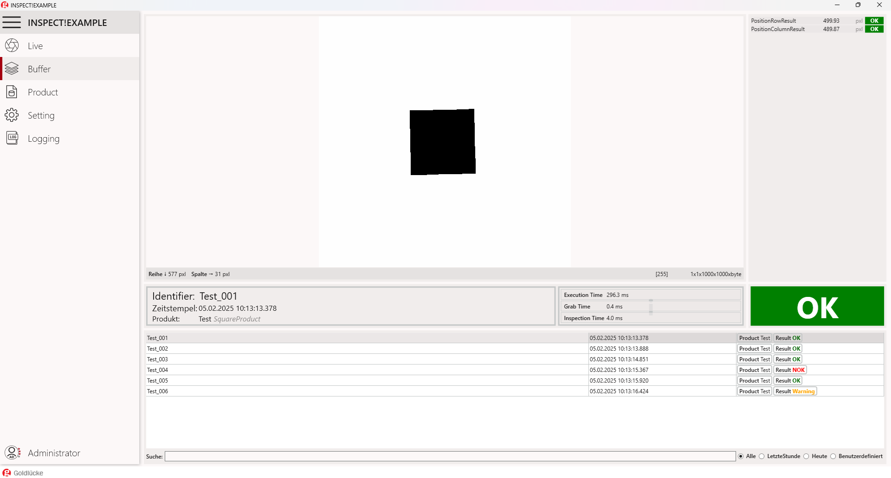
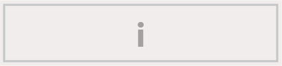
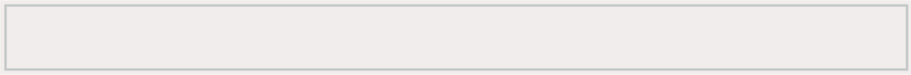

# Buffer

### General

Der Buffer zeigt den aktuellen Inhalt des Ringspeichers in einer Listenansicht an, die nach Datum oder Kennung durchsucht werden kann.

### GUI

### Liste der Daten im Puffer

Der Buffer bietet die Sichtung aller Datensätze im Ringspeicher. Mithilfe von Filtern können gewünschte Zeitpunkte oder Produkte gefiltert werden.

### Filtern von Datensätze nach Datum unter
{: class="no-audio" }

### Informationen des aktuell ausgewählten Datensatzes

### Prüfergebnis des aktuell ausgewählten Datensatzes

### Detailiertes Prüfergebnis

### Schneller Zugriff auf den Ordnerpfad eines bestimmten Datensatzes

Das Kontext-Menü (Rechtklick) bietet weitere Möglichkeiten mit dem Datensatz zu interagieren.

