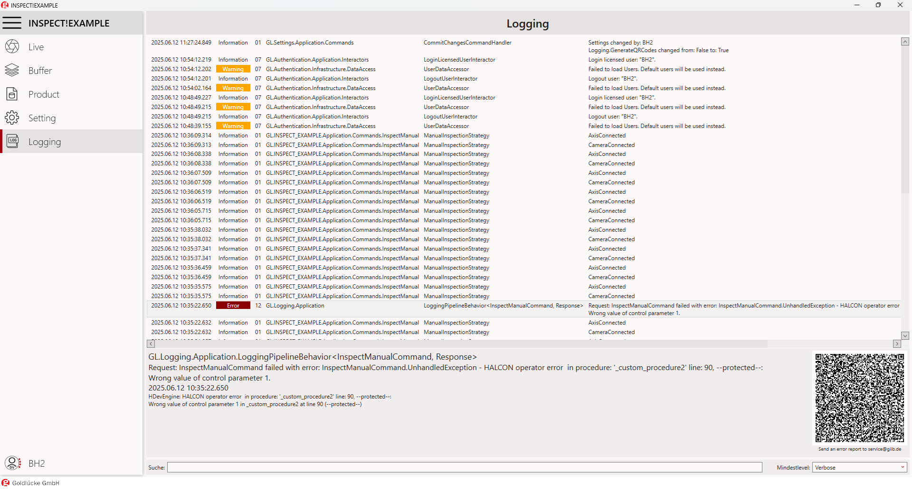
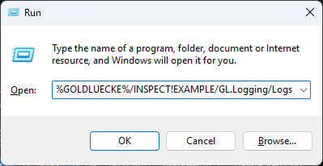
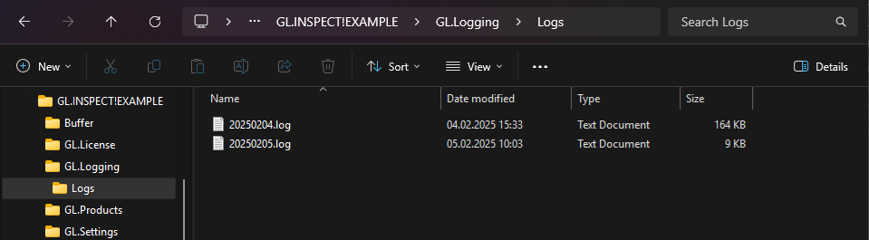
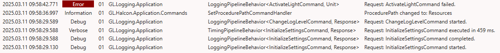

# Logging

### General

Logging liefert detaillierte Informationen über interne Programmabläufe.

### GUI

### Speicherort der Loggingdateien

Die Log-Dateien befinden sich im Unterverzeichnis "Logs" des "GL. Logging"-Verzeichnis. Jede Datei enthält alle Protokolleinträge für einen bestimmten Tag.

`%GOLDLUECKE%/PORE!SCAN/GL.Logging/Logs`

Öffnen des Ordner-Pfades per Tastenkombination :material-microsoft-windows: + R:

### Logging Level

Die Protokollierungsstufen bestimmen, welche Ereignisse im System aufgezeichnet werden – von kritischen Abstürzen bis hin zu den kleinsten Details.

??? note "Standard-Protokollierungsstufen (in absteigender Reihenfolge der Schwere)"
    1. **Fatal**:
        - Weist auf einen schwerwiegenden Fehler hin, der dazu führt, dass die Anwendung abstürzt oder unbrauchbar wird.
        - Beispiel: Nicht behebbarer Systemfehler, Speicherüberlauf-Ausnahme.

    2. **Error**:
        - Wird für Probleme verwendet, die Aufmerksamkeit erfordern, aber nicht unbedingt katastrophal sind.
        - Stellt ein erhebliches Problem dar, das verhindert, dass eine bestimmte Operation erfolgreich ausgeführt wird, wobei die Anwendung jedoch weiterlaufen kann.
        - Beispiel: Fehlgeschlagene Datenbankverbindung, ungültige Benutzereingabe, die eine Ausnahme verursacht.

    3. **Warning**:
        - Hebt ein potenzielles Problem oder etwas Unerwartetes hervor, das die Funktionalität nicht sofort beeinträchtigt.
        - Beispiel: Verwendung einer veralteten API, nahezu ausgelastete Ressourcen.

    4. **Information**:
        - Allgemeine Betriebsmeldungen über den Status oder Fortschritt der Anwendung.
        - Beispiel: Anwendung gestartet, Benutzer angemeldet, Prozess erfolgreich abgeschlossen.

    5. **Debug**:
        - Detaillierte Informationen für Debugging-Zwecke, typischerweise von Entwicklern während der Entwicklung oder Fehlerbehebung verwendet.
        - Beispiel: Variablenwerte, schrittweise Ausführungsdetails.

    6. **Verbose**:
        - Die detaillierteste Stufe, die alles erfasst, einschließlich Operationen auf niedriger Ebene.
        - Beispiel: Rohe Prozedur-Anfragen, Methodenein- und -austritte.
        - Oft deaktiviert aufgrund der Ausführlichkeit.