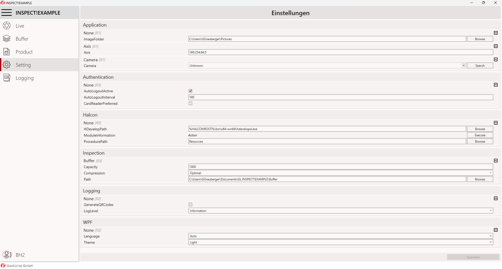
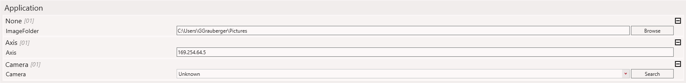
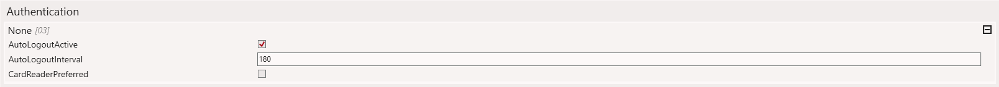
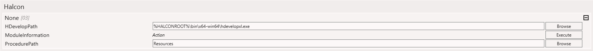
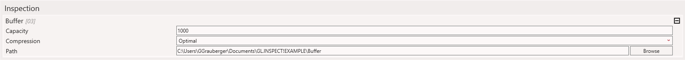
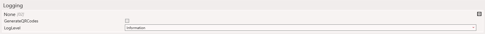
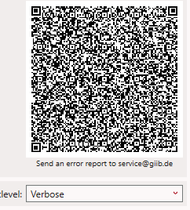
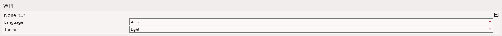

# Settings

Settings bietet verschiedene Einstellungen zur Inbetriebnahme, Anpassung und Optimierung.

Die Settings sind je nach aktueller [Benutzerebene](../GL.Authentication/usermanagement.md#benutzer-ebene) nicht verfügbar.

### GUI

### Application

Die Anwendungseinstellungen bietet diverse Hardware-Einstellungen:

???+ note "Application [03] Parameters"

    **ImageFolder**: :material-folder-sync: Ordnerpfad zum einlesen von Bildern (wenn keine Bilder von der Kamera eingelesen werden)

    **Axis**: :material-ip-network: IP-Adresse der Achse

    **Camera**: :material-ip-network: Auswahl und Erkennung der Kamera Über :material-magnify: `Search` lässt sich der Camera-String finden, der wichtige Informationen wie die Seriennummer enthält.

### Authentication  

  

???+ note "Authentication [03] Parameter"  

    **AutoLogOutActive**: Gibt an, ob der aktuelle User nach einer festgelegten Zeit ausgeloggt werden soll  
    
    **AutoLogOutIntervall**: Die bestimmte Zeit in Minuten, nach der der User ausgeloggt wird :octicons-clock-16:

    **CardReaderPreferred**: Angabe, ob der User-Login über ein Kartenlesegerät erfolgen soll :material-checkbox-marked-outline:  

### Halcon  

  

???+ note "Halcon [03] Parameter"  

    **HDevelopPath**: Pfad zur HDevelop-Executable  

    **ModuleInformation**: Anzeige und Ausführung von Halcon-Modulen  

    **ProcedurePath**: Gibt den Ordnerpfad an, in dem die Halcon-Prozeduren liegen :material-folder:  

### Inspection

???+ note "Buffer [03] Parameters"

    **Buffer Capacity**: Größe des Ringspeichers (Bilderanzahl)  

    **Compression**: Kompressionsstufe für gespeicherte Bilder  

    **Path**: Speicherort des Puffers  

### Logging  

  

???+ note "Logging [01] Parameter"

    **GenerateQRCodes**: Erstellt QR-Codes (im Menüpunkt Logging) zum schnellen Teilen von Log-Daten über Email  
    **LogLevel**: Gibt an, welche Programm-Events in den Logs gespeichert werden sollen  
    

### WPF  

???+ note "WPF Parameters"

    **Language**: Sprache der Benutzeroberfläche  

    **Theme**: Benutzeroberfläche-Design (Hell/Dunkel)  