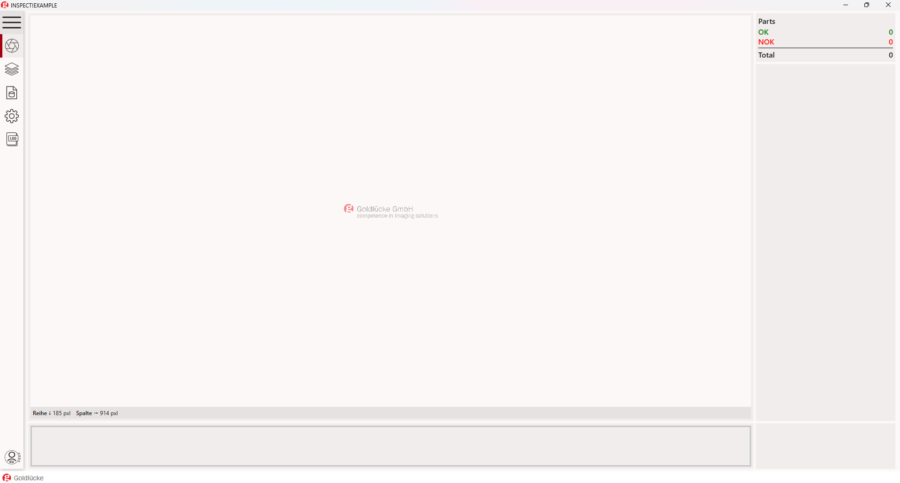
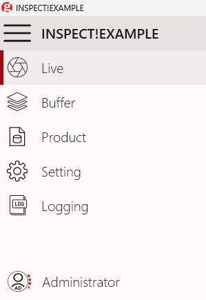
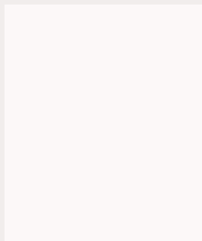
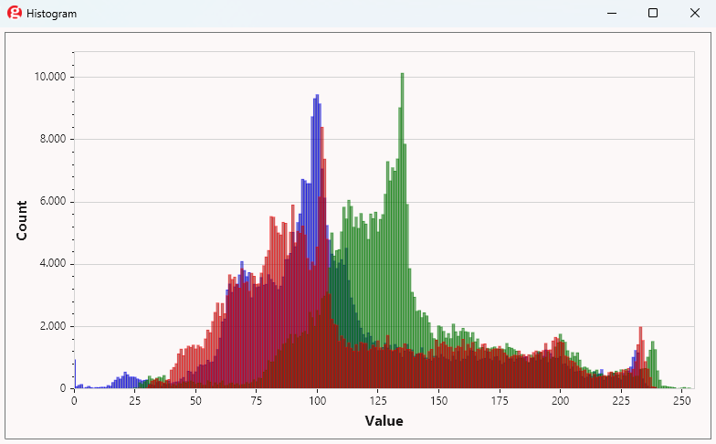
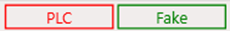
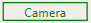
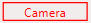

# Benutzer-Oberfläche (GUI)

GUI nach Programmstart:

{ width=75% }

### Men&uuml; Band

Das Seitenmen&uuml; auf der linken Seite ist ausklappbar.

 Es zeigt je nach [Benutzerebene](./GL.Authentication/usermanagement.md#benutzer-ebene) eventuell mehr oder weniger Optionen.

| Men&uuml;band | Dokumentationsseiten |
|---------|---------------------------|
|  |     [Live](./Live/live.md)  Aktuell verarbeiteter Datensatz   [Buffer](./GL.Buffer/buffer.md)  Datens&auml;tze im Ringspeicher   [Product](./GL.Buffer/buffer.md)  Produkt-Einstellungen   [Setting](./Product/product.md)  Programm-Einstellungen   [Logging](./GL.Settings/settings.md)  Einsicht in interne Programabl&auml;ufe   [User management](./GL.Authentication/usermanagement.md)   Benutzer-Management |

## View-Overlay

Als ausklappbares Hover-Over-Menü - In der linken oberen Ecke finden sich die Einstellungen zur Bild-Ansicht und deren Overlays

Hier lassen sich verschiedene Overlays einblenden und Ansichtsoptionen verändern.

Allgemeinere Funktionen:

- Histogramm: Statistische Darstellung des aktuellen Datensatzes  

- 3D-Anzeige: Der Wechsel auf die 3D-Ansicht die sich vorallem für Datensätze mit Höheninformationen eignet.
- Darstellung: Verschiedene Optionen wie die Anzeige als "Temperature"-Gradient

## Status-Leiste

Die Status-Leiste unten rechts ist in jedem Programm-Teil sichtbar und zeigt den aktuellen Status der jew. Kommunikation.

Beispiel:

Aktueller Status: SPS-Kommunikation
Aktueller Status: Kamera

Durch einen Doppelklick :material-cursor-default-click: auf einen Status wird das jeweilige Gerät entweder **Connected** oder **Disconnected**:  
- **Connected**:   
- **Disconnected**: 