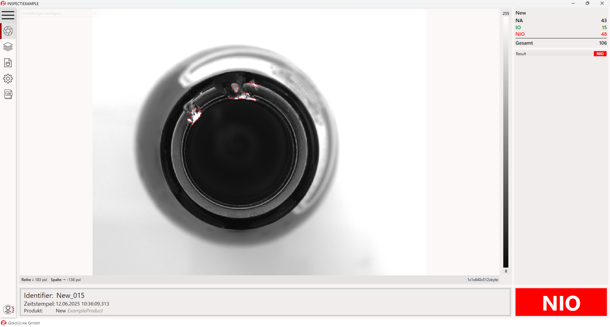

# Live

### General

Die Live-Ansicht zeigt das aktuelle Bild mit dem Inspektions-Overlay, das Inspektions-Ergebnis und andere nützliche Informationen wie die Gesamtzahl der verarbeiteten Bilder an.

### GUI

## Identifikator

+ Identifikator: Zeigt die von der SPS übermittelte ID-Nummer
+ Zeitstempel: Datums- und Zeitstempel
+ Produkt: Aktuell verwendete Produkt-Vorlage

## Gesamtanzahl der verarbeiteten Bilder

## Prüfergebnis als OK oder NOK

