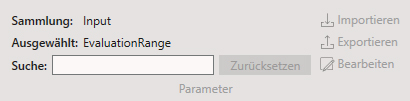

# Product

### General

In Product können Produktpläne erstellt und bearbeitet werden. Neben einer Übersicht aller Input-Parameter und einer detaillierten Darstellung der Output-Parameter finden Sie hier auch zahlreiche weitere Einstellungsmöglichkeiten für die Bildverarbeitung.

### GUI

### Toolbar

Aktuell ausgewähltes Produkt und Procedure

#### Produkt

Dieser Toolbar-Abschnitt bietet verschiedene Möglichkeiten, Produkt-Profile zu bearbeiten, neu zu erstellen oder anzupassen.
Nach diesen Produkt-Profilen als Vorgabe werden die Bilddaten analysiert und entsprechend verarbeitet.

#### Prüfplan

Verwaltet den aktuell im Produkt geladenen  HALCON-Code.

#### Steuerung

Der Steuerungs-Toolbar-Abschnitt ermöglicht das Wechseln zwischen Live-Betrieb und Ringspeicher-Modus sowie das Ausführen der Bildverarbeitung.  

??? note "Steuerung"  

    ||||
    |--------------|--------------|--------------|
    || **Live** **Manuell** | Wechselt die aktuelle Ansicht auf `Live` / `Manuell` |
    || **Ringspeicher** | Blendet die Liste der gespeicherten Datensätze ein und ermöglicht die erneute Analyse mit der aktuell geladenen Produkt-Vorlage |
    || **Ausf&uuml;hren** | Startet je nach aktueller Ansicht (Live/Ringspeicher) die Aufnahme eines neuen Datensatzes oder verarbeitet den aktuell im Ringspeicher gewählten Datensatz erneut |
    |  | **Identifier** | Benennung des aktuell ausgewerteten Datensatzes |
    |  | **AutoInkrement** | Automatisches Hochzählen der Datensatznummer |
    |  | **Halcon** | Zugriff auf die HALCON-Prozesskonfiguration |

#### Parameter

Der Parameter Toolbar-Abschnitt bietet verschiedene Möglichkeiten, Parameter des aktuellen Produkt-Profile zu bearbeiten.
Funktionen sind je nach zugewiesenem Benutzer-Berechtigungen oder ausgewähltem Objekt ausgegraut und somit gesperrt.

Zur Bearbeitung einer z.B. HRegion wählen Sie diese aus und wählen 

{: clas="no-audio" }

Die Parameter-Suche bietet das reduzieren der Ansicht auf die gewünschten Parameter.

