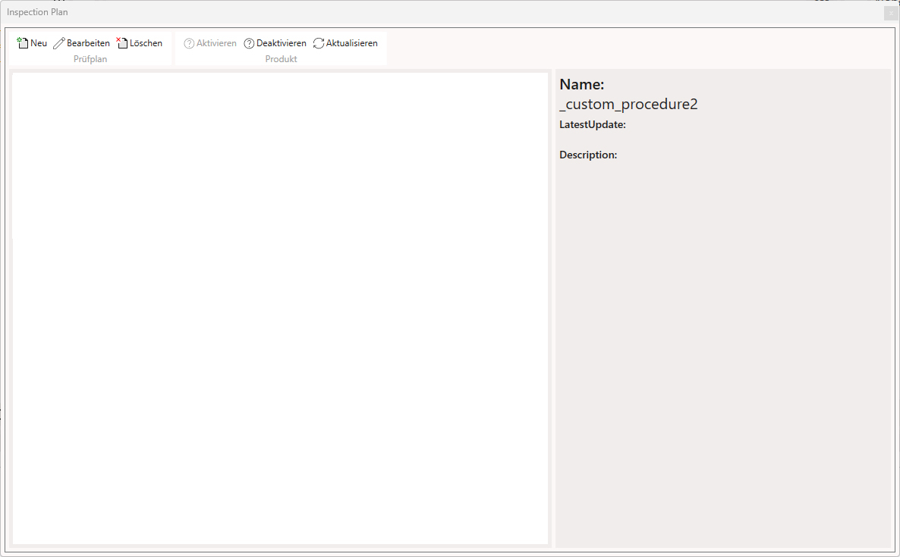
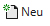
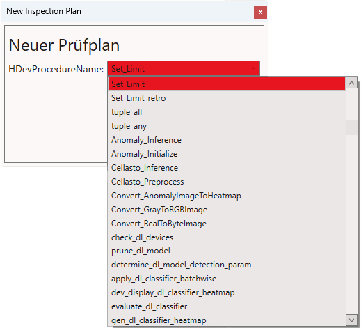
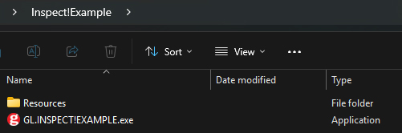
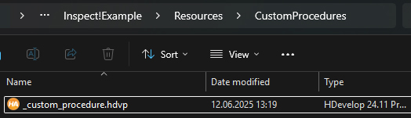
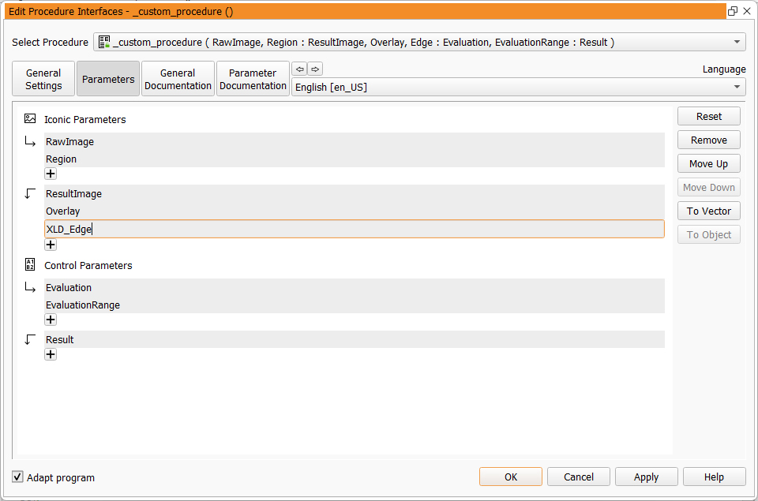
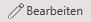
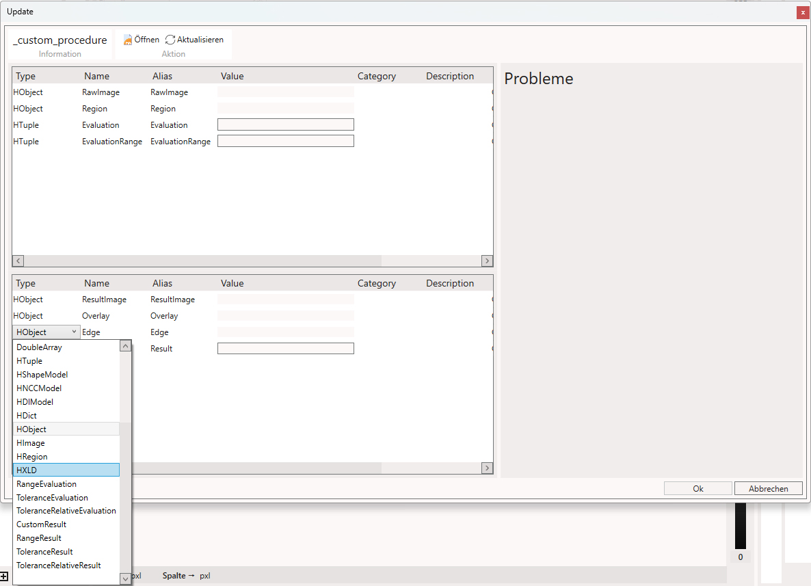

# Halcon-Initialisierung

Erstellen Sie in neues Produkt.

Öffnen Sie den Inspection Plan via 

Hier laden wir später unsere erstellte Prozedur über .

Die geladenen Prozeduren liegen im Ordner `Resources` und können dort erstellt, bearbeitet und abgelegt werden.

Wir erstellen eine `.hdvp` namens `_custom_procedure.hdvp`

Öffnen diese in Hdevelop und setzen die gewünschten `Input`- und `Output`-`Parameter`

Starten Sie INSPECT!EXAMPLE neu und erstellen den `Inspection Plan` mit unserer neuen Prozedur über .

Wählen Sie die Prozedur aus und wählen über  die richtigen Typen aus wie `HImage`, `HRegion` oder `CustomResult`

