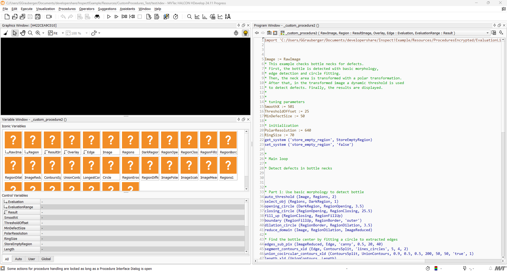
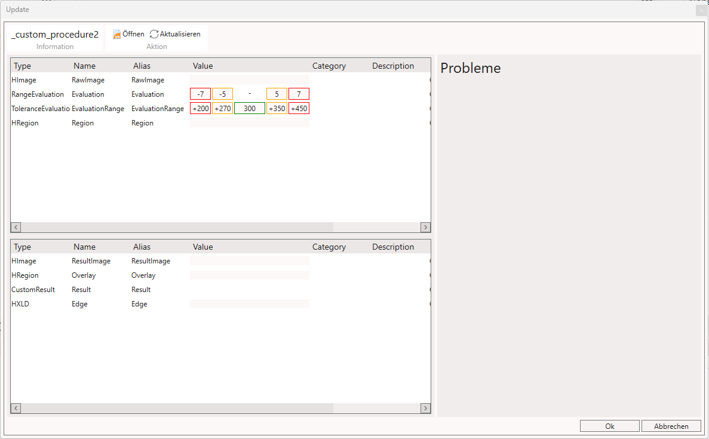
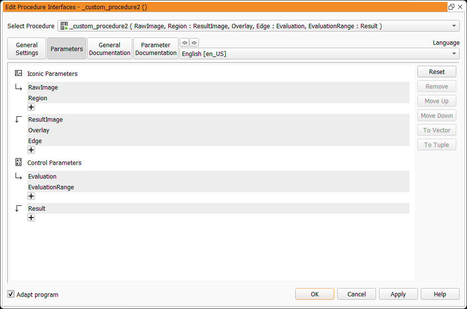
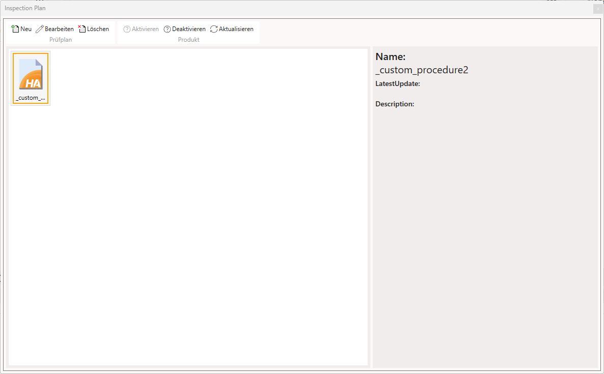

# Prüfplan

### General

Verwaltet den aktuell im Produkt geladenen  HALCON-Code.

||||
|--------------|--------------|--------------|
|         | **Öffnen** | Öffnet den aktuellen Prüfplan extern in HDevelop |
|   | **Aktualisieren** | Öffnet den aktuellen Prüfplan - neu einlesen und aktualisieren |
|       | **Verwalten**     | Prüfpläne verwalten und organisieren |

### Öffnen - Öffnet den aktuellen Prüfplan extern in HDevelop

Öffnet die aktuelle im Produkt aktive Halcon-Prozedur (`.hdvp`) mithilfe des unter [Settings](../GL.Settings/settings.md#halcon) eingestellten `HDevelop`.

### Aktualisieren - Öffnet das `Update`-Fenster

Hier lassen sich die in der `Procedure` festgelegten `Input`- und `Output`-`Parameter` der  bearbeiten und einstellen.   (Die `Parameter` müssen zuerst in der Halcon-`Procedure` angelegt werden, bevor diese im Update-Fenster eingebunden werden können.)

### Verwalten - Öffnet das `Inspection-Plan`-Fenster

Hier kann die aktuelle `Procedure` ausgewählt und aktiviert werden.

Eine Prozess-Beschreibung hierzu finden Sie unter [Halcon-Procedure Initialisieren](product_halcon_initialize.md)