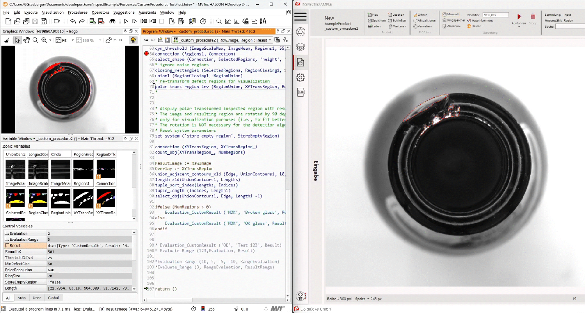


This is a template. :octicons-repo-template-24: 
This site is the reason you get WARNING's :warning: while building. 
It's supposed to be like that, so you know where you have to change stuff. 
Only this document (and Quickstart.mp4) has broken .md links :broken_chain:

Select the desired content cards :material-card-multiple: and remove the rest.                                                                                            


### Ihr  HALCON-Code. Unsere Benutzeroberfläche.  Mit unserem GUI-Framework {{ var_inspect }}!{{ var_example }}

-   :material-tune:{ .lg .middle } __Halcon-Code Implementierung__

    

    ---

    [`Implementierung`](./Product/presentation_product.md) Ihres bestehenden HALCON-Codes mit unserem Framework

-   :octicons-device-desktop-24:{ .lg .middle } __Halcon-Live Debugging__ 

    

    --- 

    [`Live-Debugging`](./Product/presentation_product.md#halcon-live-debugging) zur direkten Ausführung und Bearbeitung in HDevelop

-   :material-account-group:{ .lg .middle } __Benutzerverwaltung__

    

    ---

    [`Benutzerverwaltung`](./GL.Authentication/usermanagement.md) zur Verwaltung von Nutzern-Rechten

-   :material-file-document:{ .lg .middle } __Logging__

    

    ---

    [`Logging`](./GL.Logging/logging.md) bietet Einsicht in interne Programmabläufe

-   :material-cog:{ .lg .middle } __Einstellungen__

    

    ---

    [`Programm-Einstellungen`](./GL.Settings/settings.md) zur Konfiguration der Anwendung

## {{ var_inspect }}!{{ var_example }} - Goldlücke GmbH 

-   :material-video:{ .lg .middle } __Quickstart.mp4__

    

    ---

    [`Quickstart Video`](quickstart.md) bietet eine kompakte Einführung in die wichtigsten Bestandteile der Software, um mit der Arbeit zu beginnen!

-   :material-tune:{ .lg .middle } __Kalibrierung__

    

    ---

    [`Kalibrierung`](changelog.md) zur Abstimmung von Kamera, Objektiv und Fokuslinse

-   :octicons-device-desktop-24:{ .lg .middle } __Lokale Einrichtung__ 

    

    --- 

    [`Kurzanleitung`](changelog.md) zur lokalen Installation und Konfiguration  

-   :material-eye:{ .lg .middle } __Live__

    

    ---

    [`Live Ansicht`](./Live/live.md) zeigt den aktuell verarbeiteten Datensatz

-   :material-cog:{ .lg .middle } __Einstellungen__

    

    ---

    [`Programm-Einstellungen`](./GL.Settings/settings.md) zur Konfiguration der Anwendung

-   :material-file-document:{ .lg .middle } __Logging__

    

    ---

    [`Logging`](./GL.Logging/logging.md) bietet Einsicht in interne Programmabläufe

-   :material-account-group:{ .lg .middle } __Benutzerverwaltung__

    

    ---

    [`Benutzerverwaltung`](./GL.Authentication/usermanagement.md) zur Verwaltung von Nutzern

-   :octicons-file-added-24:{ .lg .middle } __Erstellung eines neuen Modells__ 

    

    --- 

    [`Kurzanleitung`](./changelog.md) zur Modellerstellung  

    [:octicons-arrow-right-24: Video hier](#)  

-   :octicons-copy-24:{ .lg .middle } __Umgang mit Regionen__ 

    

    --- 

    [`Kurzanleitung`](./changelog.md) zur Verwaltung von Regionen  

    [:octicons-arrow-right-24: Video hier](#)  

